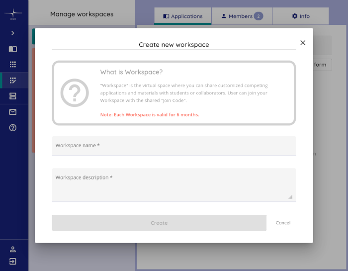

# *CSC Notebooks* dockerfile

This is to keep track of changes to the dockerfile used to instantiate
containers in which CSC Notebooks are run.

When creating the *CSC Notebooks* workspace and application, this repository can
be directly referenced, see detailed instructions below.


## Steps to create docker image, a workspace and application for AutoGIS


### 1. Create a docker image

- Check out this repository
- Adjust environment variables in `Dockerfile`
    - Specifically, make sure that `AUTOGIS_SITE_COMMIT` is referencing
      a commit of [`Automating-GIS-processes/site`](https://github.com/Automating-GIS-processes/site)
      in which the `ci/environment.yml` has been updated to list packages
      pinned to up-to-date versions (see the [README
      there](https://github.com/Automating-GIS-processes/site/blob/main/README.md))

- Build the docker image:
```
docker build --network=host --tag autogis2022 ./
```


### 2. Upload the docker image to CSC’s *rahti* repository

- Follow the [instructions in CSC’s user manual](https://docs.csc.fi/cloud/csc_notebooks/guide_for_teachers/#add-the-image-to-rahti-registry)
to upload the image to their docker registry.
    - I used `autogis` as `<yourrahtiproject>`, `autogis2022` as `<yourimagename>`,
      and `v2022.1` (and `v2022.2` ...) as the version tag.
      *Note that you have to create a *Rahti* project beforehand.*

### 3. Create a workspace



Log into https://notebooks.csc.fi/, navigate to ’Manage workspaces’, and choose
’Create new workspace’. Fill in the necessary details, and choose ’Create’. 

As an example, for the 2022 iteration of the course,
I entered the following information:

| workspace name                   | workspace description                   |
|:-------------------------------- |:--------------------------------------- |
| Automating GIS processes 2, 2022 | ‘Automating GIS processes 2’ is a Masters’ level course at the Department of Geosciences and Geography, University of Helsinki. https://studies.helsinki.fi/courses/?searchText=GEOG-329-2 |

**Note**: CSC Notebook workspaces have a default lifetime of only 180 days. Be
sure to create the workspace late enough so it lasts for the entire course.


### 4. Create an application

Navigate to ‘Manage workspaces’, then choose the newly created workspace in the
left pane. 

- On the right side, open the ’Applications’ tab and click ’+ Application’.
- Choose *any* of the available *template*s (we are using our custom image,
  anyways)
- Enter the resulting *container image* path and tag from step 2 (it should look something
  like `docker-registry.rahti.csc.fi/autogis/autogis2022:v2022.1`)
- Enter a *name* and *description* (in 2022, I used the same values as for
the workspace, see table above). Fiddle with the tags if you feel like it.
- Then, select ’Lab’ as the *jupyter interface*, a *session lifetime* appropriate
  for the course, and as much *memory* as you can per student (this can be increased
  upon request, if, e.g., accessibility calculations or other RAM-intensive
  analyses are carried out)
- Choose ‘Git clone from repository’ as a *Download method*, and add the URL of the
  [`Automating-GIS-processes/notebooks`](https://github.com/Automating-GIS-processes/notebooks)
  as a *Source (URL)*: `https://github.com/Automating-GIS-processes/notebooks.git`
- Enable *Shared folder*s and *User work folder*s.


